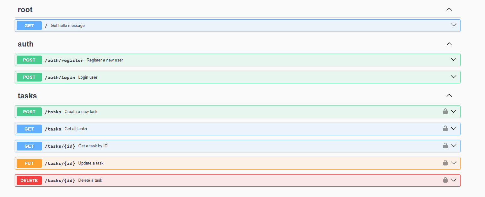

# API de Gerenciamento de Tarefas

Uma API RESTful para gerenciamento de tarefas construída com NestJS. Esta aplicação fornece um sistema backend robusto para gerenciar tarefas, incluindo autenticação de usuários, criação, atualização, filtragem e exclusão de tarefas.



## Stack de Tecnologias

- **Framework**: [NestJS](https://nestjs.com/) - Um framework progressivo do Node.js para construção de aplicações server-side eficientes, confiáveis e escaláveis.
- **Banco de Dados**: SQLite com TypeORM - Banco de dados relacional leve para desenvolvimento e testes.
- **Autenticação**: JWT (JSON Web Tokens) - Estratégia de autenticação segura usando Passport.js.
- **Documentação**: Swagger/OpenAPI - Documentação completa da API.
- **Validação**: Class-validator e class-transformer - Validação robusta de entradas.

### Justificativa para Escolha das Tecnologias

O NestJS foi escolhido porque fornece uma arquitetura estruturada baseada nos conceitos do Angular. Isso garante um código bem organizado, escalável e fácil de manter. O suporte embutido ao TypeScript, injeção de dependência e design modular permite uma separação clara de responsabilidades e um código facilmente testável.

## Configuração do Projeto

### Pré-requisitos

- Node.js (v16.x ou superior)
- npm (v8.x ou superior)

### Instalação

1. Clone o repositório
   ```bash
   git clone https://github.com/seu-usuario/rankioshi-todo-apit
   cd rankioshi-todo-apit
   ```

2. Instale as dependências
   ```bash
   npm install
   ```

## Executando a Aplicação


### Modo de Desenvolvimento

Execute a aplicação em modo de observação:
```bash
npm run start:dev
```

### Modo de Produção

Compile e execute a aplicação:
```bash
npm run build
npm run start:prod
```

A aplicação estará disponível em `http://[::1]:3000`

## Documentação da API

A documentação Swagger está disponível em `http://[::1]:3000/api` quando a aplicação estiver em execução.

## Testando a API

### Usando cURL

#### Autenticação

**Registrar novo usuário**
```bash
curl -X POST http://[::1]:3000/auth/register   -H "Content-Type: application/json"   -d '{"username": "testuser", "password": "Password123!"}'
```

**Login**
```bash
curl -X POST http://[::1]:3000/auth/login   -H "Content-Type: application/json"   -d '{"username": "testuser", "password": "Password123!"}'
```

> Salve o token retornado para usar nas requisições seguintes

#### Gerenciamento de Tarefas

**Criar uma tarefa**
```bash
curl -X POST http://[::1]:3000/tasks   -H "Content-Type: application/json"   -H "Authorization: Bearer SEU_TOKEN_JWT"   -d '{"title": "Completar projeto", "description": "Finalizar o projeto NestJS", "status": "OPEN"}'
```

**Listar todas as tarefas**
```bash
curl -X GET http://[::1]:3000/tasks   -H "Authorization: Bearer SEU_TOKEN_JWT"
```

**Filtrar tarefas por status**
```bash
curl -X GET "http://[::1]:3000/tasks?status=IN_PROGRESS"   -H "Authorization: Bearer SEU_TOKEN_JWT"
```

**Buscar tarefa por id**
```bash
curl -X GET http://[::1]:3000/tasks/1   -H "Authorization: Bearer SEU_TOKEN_JWT"
```

**Atualizar uma tarefa**
```bash
curl -X PUT http://[::1]:3000/tasks/1   -H "Content-Type: application/json"   -H "Authorization: Bearer SEU_TOKEN_JWT"   -d '{"status": "DONE"}'
```

**Deletar uma tarefa**
```bash
curl -X DELETE http://[::1]:3000/tasks/1   -H "Authorization: Bearer SEU_TOKEN_JWT"
```

### Usando Insomnia/Postman

Um arquivo de coleção para Insomnia ou Postman pode ser importado de `docs/api-collection.json` (Observação: você precisa criar este arquivo separadamente).

## Decisões Técnicas

### Arquitetura

A aplicação segue uma arquitetura modular com separação clara de responsabilidades:
- **Módulo de Autenticação**: Gerencia autenticação e autorização de usuários
- **Módulo de Usuários**: Gerencia a entidade usuário e suas operações
- **Módulo de Tarefas**: Funcionalidade principal de gerenciamento de tarefas
- **Módulo Comum**: Utilitários compartilhados, guards e decorators

### Design do Banco de Dados

A aplicação usa TypeORM com SQLite para persistência de dados:
- **Entidade Usuário**: Armazena credenciais e informações pessoais dos usuários
- **Entidade Tarefa**: Armazena detalhes das tarefas com relação ao usuário que a criou

### Segurança

- Senhas são criptografadas usando bcrypt
- Tokens JWT são usados para autenticação
- Guards protegem as rotas que exigem autenticação
- Validação garante integridade dos dados

## Melhorias Futuras

Com mais tempo, as seguintes melhorias podem ser implementadas:

1. **Migração de Banco de Dados**: Implementar um sistema de migração para alterações de schema.

2. **Testes**: Aumentar a cobertura de testes unitários e e2e.

3. **Filtragem Avançada**: Implementar paginação e filtros mais complexos para tarefas.

4. **Integração com PostgreSQL**: Substituir o SQLite por PostgreSQL para ambientes de produção.

5. **Cache**: Implementar cache com Redis para dados frequentemente acessados.

6. **Papéis de Usuário**: Adicionar controle de acesso baseado em papéis (RBAC).

7. **Logs e Monitoramento**: Implementar sistema de logs com Winston ou Pino.

8. **CI/CD**: Criar pipelines de testes e deploy automatizados.

9. **Dockerização**: Containerizar a aplicação para facilitar o deploy.

10. **Tokens de Atualização**: Implementar refresh tokens para mais segurança.

## Contato

- Linkedin: https://www.linkedin.com/in/gabrielseren/
- GitHub: https://github.com/rankioshi
- Email: gabrielrankseren@gmail.com
